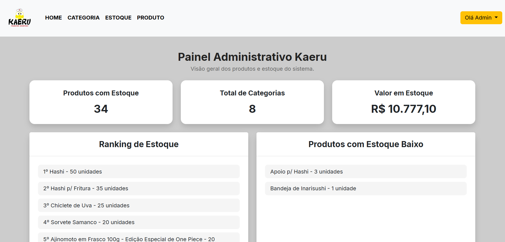

# 🐸 Kaeru Produtos Orientais — Painel Administrativo

🇧🇷 **Português** | [🇺🇸 English](README.en.md) | [🇯🇵 日本語](README.ja.md)

Painel administrativo desenvolvido como parte do projeto acadêmico **Kaeru Produtos Orientais**, durante o curso de Análise e Desenvolvimento de Sistemas no Centro Universitário Integrado.

Esta aplicação representa a área interna do sistema, responsável pelo gerenciamento dos dados utilizados pelo catálogo público da Kaeru.

## 📸 Preview

## ✨ Funcionalidades

- Autenticação de administrador
- Controle de sessão
- Cadastro de produtos
- Edição de produtos
- Exclusão de produtos
- Gerenciamento de categorias
- Integração com banco de dados
- Validação de formulários
- Interface administrativa separada do catálogo público
- Dashboard com indicadores de produtos, categorias e estoque

## 🛠️ Tecnologias utilizadas

- PHP
- MySQL / MariaDB
- HTML
- CSS
- Bootstrap
- JavaScript
- TypeScript
- PDO

## 🗂️ Sobre o sistema

O painel administrativo foi desenvolvido separadamente da interface pública da Kaeru.

Por meio dele, é possível gerenciar os dados utilizados pelo catálogo, mantendo as operações administrativas fora da interface destinada aos visitantes.

## ⚙️ Execução local

O projeto utiliza PHP e MySQL/MariaDB e pode ser executado localmente utilizando um ambiente como o XAMPP.

É necessário configurar a conexão com o banco de dados de acordo com o ambiente local antes da execução.

## 🔗 Catálogo

A interface pública do projeto está disponível em um repositório separado.

➡️ [**Kaeru Produtos Orientais — Catálogo**](https://github.com/wdninjaytb/kaeru-catalogo)

## 🎓 Contexto

Projeto desenvolvido como atividade acadêmica do curso de **Análise e Desenvolvimento de Sistemas**.

O desenvolvimento do painel envolveu conceitos de autenticação, sessões, operações CRUD, integração com banco de dados e construção de interfaces administrativas.

## ⚠️ Aviso

Este projeto foi desenvolvido para fins acadêmicos com autorização da **Kaeru Produtos Orientais**, estabelecimento real localizado em Campo Mourão, Paraná.

As informações comerciais presentes no projeto foram utilizadas com autorização durante o desenvolvimento.

Este repositório disponibiliza o código-fonte exclusivamente para fins acadêmicos e de portfólio. A aplicação não representa um sistema administrativo oficial da empresa e não está hospedada ou disponível publicamente como serviço.
